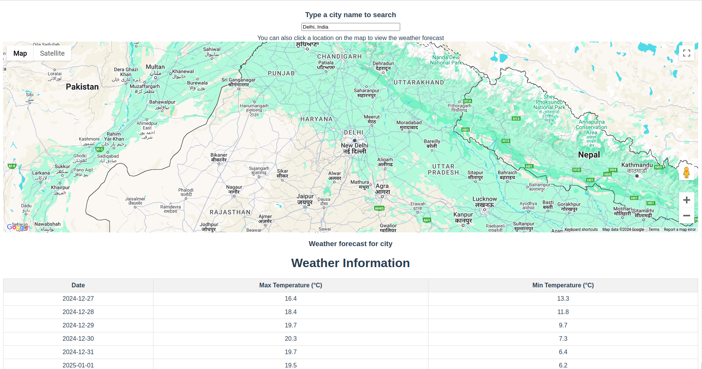

# Introduction
This is an application to show weather forcast for next five days of any city / town in the world

## Features

Search any town / city in the world to get the weather forcast

- Created backend API call to get the weather forecast for a given latitude and longitude. 
- Updated the frontend to use the new API call and display the weather forecast for a selected location.
- The location can be chosen either by searching for a city name.
- Proper error and loading status are displayed for users.
- Ensured the commits are atomic and meaningful, and the code is well-formatted and easy to read.
- Styled the compoents using tailwindcss.
- Dockerised  the entire application.
 To run 
```
docker compose up --build
```
and navigate to http://localhost:8080
- Created Jenkins CI/CD pipeline to run the tests and deploy the application.
- Integrated Verson Up feature to enhance developer experience .


## Screenshot
